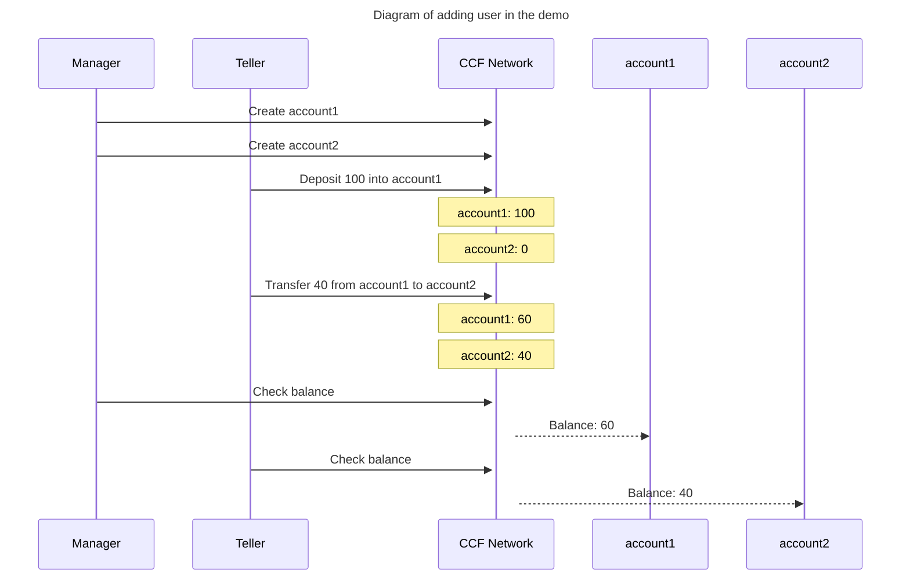

# Banking application

This is a sample application of a bank. It uses the following features available in Azure Confidential Ledger to showcase a widely used banking scenario.

    - Custom roles
    - Custom actions and RBAC.
    - Multiple Authentication schemes.

## Prerequisites

Before running this sample, ensure you have the following tools installed on your system:

### Required Software

1. **Node.js** (version 16 or higher)
   - Download from [nodejs.org](https://nodejs.org/)
   - Verify: `node --version`

2. **npm** (comes with Node.js)
   - Verify: `npm --version`

3. **Bash shell**
   - Linux/macOS: Available by default
   - Windows: Use Git Bash, WSL, or similar

4. **Make**
   - Linux: `apt-get install make` (Debian/Ubuntu) or `yum install make` (RHEL/CentOS)
   - macOS: `xcode-select --install`
   - Windows: `choco install make` or use WSL

5. **OpenSSL**
   - Required for certificate generation
   - Verify: `openssl version`

6. **curl**
   - Required for API testing
   - Verify: `curl --version`

7. **Azure CLI**
   - Install from [docs.microsoft.com/cli/azure/install-azure-cli](https://docs.microsoft.com/cli/azure/install-azure-cli)
   - Login: `az login`
   - Verify: `az --version`

### Azure Requirements

- An active Azure subscription
- Permissions to create Azure Confidential Ledger instances and resource groups
- Azure CLI authenticated: `az login`

## Setup

1. **Install dependencies**:
   ```bash
   cd banking-app
   npm install
   ```

2. **Build the application**:
   ```bash
   npm run build
   # or
   make build
   ```

   This will:
   - Compile TypeScript to JavaScript using Rollup
   - Bundle the application modules
   - Generate `dist/bundle.json` for deployment

### Verify Your Setup

Run these commands to verify all prerequisites are installed:

```bash
node --version     # Should show v16.x.x or higher
npm --version      # Should show 7.x.x or higher
make --version     # Should show GNU Make version
openssl version    # Should show OpenSSL version
curl --version     # Should show curl version
az --version       # Should show Azure CLI version
```

If any command fails, install the missing tool from the Prerequisites section above.

## Use case

A bank system that can be run by multiple users with different roles.

## What the application does

This application provides a REST API with the following endpoints:

- PUT `/app/account/{account_name}`
  - Create account for a bank account holder.
  - It can be called by users with manager role.
  - Status code for successful calls: 204
- POST `/app/deposit/{account_name}`
  - Deposit money.
  - It can be called by users with manager and teller role.
  - Example request body: `{ "value" : 100 }`
  - Status code for successful calls: 204
- GET `/app/balance/{account_name}`
  - Check balance.
  - It can be called by users with manager and teller role.
  - Example response: Status code 200 with body `{ "balance" : 100 }`
- POST `/app/transfer/{account_name}`
  - Transfer money from an account to another account.
  - It can be called by users with manager and teller role.
  - Example request body: `{ value : 100, account_name_to: 'accountA' }`
  - Status code for successful calls: 204

### Scenario in the demo

In this scenario, the bank has 2 employees with different roles. They are 'manager' and 'teller'.
Scenario is the following:

1. Manager adds 2 accounts, namely account1 and account2.
2. Manager deposits 100 into account1.
3. Teller transfers 40 into account2.
4. Manager (or teller) checks the balance in account1. It should be 60.
5. Teller (or manager) checks the balance in account2. It should be 40.



## How to run the tests

The banking application includes a comprehensive test suite that deploys to a real Azure Confidential Ledger instance.

### Before Running Tests

1. **Authenticate with Azure**:
   ```bash
   az login
   ```

2. **Update the Makefile** with your Azure subscription and tenant information:
   
   Edit the `Makefile` and replace the placeholders in the test target:
   ```makefile
   test: build
       @. ../scripts/test_acl.sh --subscription "<your-subscription-id>" --tenant "<your-tenant-id>" --app-dir ${CURDIR}
   ```

   To find your subscription and tenant IDs:
   ```bash
   az account show --query "{subscriptionId:id, tenantId:tenantId}" -o table
   ```

### Running the Tests

Once configured, run the complete test suite:

```bash
cd banking-app
make test
```

### What the Test Does

The test script will automatically:

1. **Generate certificates** for two users (manager and teller)
2. **Create an Azure resource group** in East US
3. **Deploy an Azure Confidential Ledger instance** (takes several minutes)
4. **Wait for the instance** to become available
5. **Install the banking application** to the ledger
6. **Create custom roles** (manager and teller) with specific permissions
7. **Register users** and assign roles
8. **Run functional tests** including:
   - Account creation
   - Deposits
   - Transfers
   - Balance queries
   - Error handling and validation
9. **Clean up resources** (delete ledger and resource group)

**Note**: The test creates real Azure resources and will incur charges. The cleanup step removes all resources, but ensure it completes successfully.

### Troubleshooting

- **Make command not found**: Install Make (see Prerequisites section)
- **Bash script errors on Windows**: Use Git Bash, WSL, or similar bash-compatible shell
- **Azure authentication errors**: Run `az login` and ensure you have permissions
- **Build failures**: Run `npm install` to ensure all dependencies are installed
- **OpenSSL errors**: Ensure OpenSSL is installed and available in your PATH
