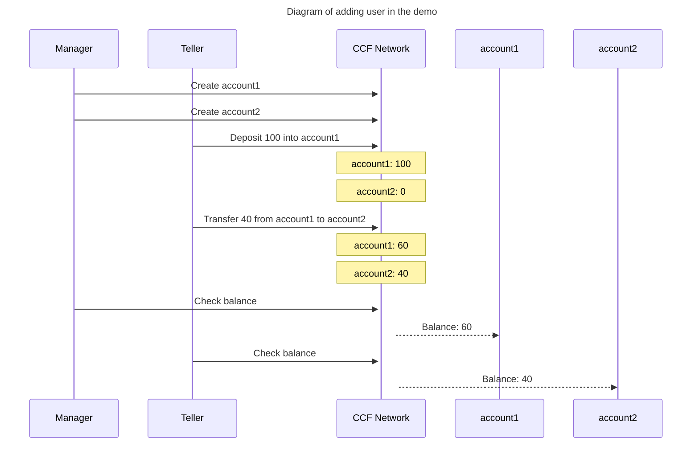

# Banking application

This is a sample application of a bank. It uses the following features available in Azure Confidential Ledger to showcase a widely used banking scenario.

    - Custom roles
    - Custom actions and RBAC.
    - Multiple Authentication schemes.

## Use case

A bank system that can be run by multiple users with different roles.

## What the application does

This application provides a REST API with the following endpoints:

- PUT `/app/account/{account_name}`
  - Create account for a bank account holder.
  - It can be called by users with manager role.
  - Status code for successful calls: 204
- POST `/app/deposit/{account_name}`
  - Deposit money.
  - It can be called by users with manager and teller role.
  - Example request body: `{ "value" : 100 }`
  - Status code for successful calls: 204
- GET `/app/balance/{account_name}`
  - Check balance.
  - It can be called by users with manager and teller role.
  - Example response: Status code 200 with body `{ "balance" : 100 }`
- POST `/app/transfer/{account_name}`
  - Transfer money from an account to another account.
  - It can be called by users with manager and teller role.
  - Example request body: `{ value : 100, account_name_to: 'accountA' }`
  - Status code for successful calls: 204

### Scenario in the demo

In this scenario, the bank has 2 employees with different roles. They are 'manager' and 'teller'.
Scenario is the following:

1. Manager adds 2 accounts, namely account1 and account2.
2. Manager deposits 100 into account1.
3. Teller transfers 40 into account2.
4. Manager (or teller) checks the balance in account1. It should be 60.
5. Teller (or manager) checks the balance in account2. It should be 40.



## How to run the tests

The banking application also has a suite of tests that run in an Azure Confidential Ledger(ACL) instance; please ensure you are logged into the Azure subscription 
where the ACL instance will be deployed.

```bash
cd banking-app
make test
```