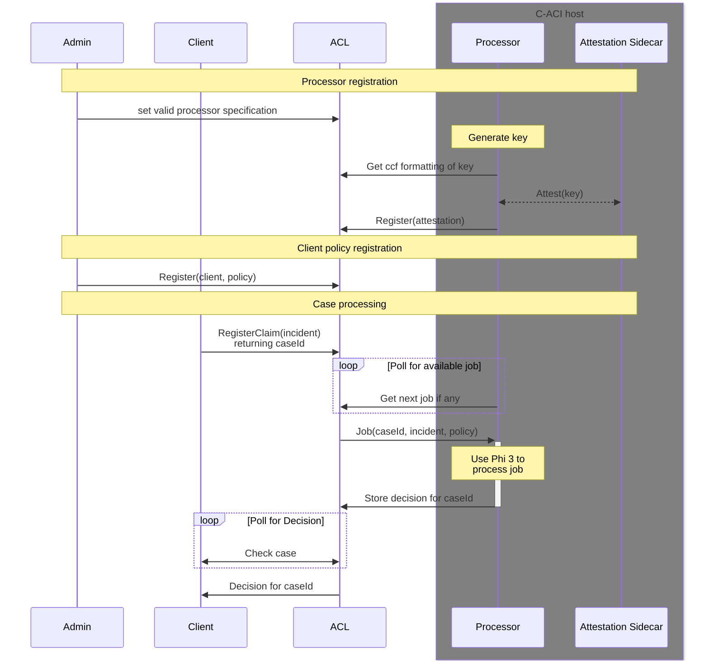

# Insurance sample for ACL

This sample demonstrates the capabilities of ACL to provide transparency and accountability for both the client and a insurance company.

The aim is to offload heavy CPU processing tasks to attested containers.
Since these containers are attested, their processing of decisions can be trusted, even though they are not executed via ACL.

## Processes

[Detailed diagram](./acl-app/README.md)

## GDPR considerations
If the incident description is considered PII, then it _cannot_ be stored in the ledger, as it cannot be removed at a later date.
Instead we suggest that users store a fingerprint (SHA-256 hash) of the incident description in the ledger and store the actual description of the incident in a separate database, that the processor then fetches the description from.
This should allow for compliance with the relevant regulations.

## Build and run this sample

### ACL app

- Ensure you have ACL running
  - To run ACL locally in virtual mode:
    - `git clone https://github.com/microsoft/tpal`
    - build with `mkdir build && cd build && CC="clang-15" CXX="clang++-15" cmake -GNinja -DCOMPILE_TARGET=virtual .. && ninja`
    - from the build directory run with `PLATFORM=virtual ../tests/start_network.sh /path/to/ccf_virtual/`
- You can now build and upload the bundle
  - In `<repository-root>/insurance-app/acl-app`
	- Install dependencies: `npm install .`
	- Build the bundle: `npm run build`
	- You should now be able to upload the bundle to ACL
	  - ` curl -X PUT -d "@dist/bundle.json" -H "Content-Type: application/json" -k --cert <path_to_admin_cert> --key <path_to_admin_privk> https://<acl-url>/app/userDefinedEndpoints?api-version=2024-08-22-preview`
		- However the admin user may not be set up yet, if you are using a local TPAL instance.
		- The `c-aci-test.py` script will set up the local TPAL instance and then try to submit a policy and incident.
- Test it is working by running the unit test after building the bundle
  - In `<repository-root>/insurance-app/acl-app`
  - `npm run build && python scripts/local-tpal-unit-test.py --bundle dist/bundle.json --tpal-tests-directory <tpal>/tests/ --sandbox-common <tpal>/build/workspace/sandbox_common --setup --add-roles`
  - This requires that the relevant packages from tpal's tests have been installed: `pip install -r <tpal>/tests/requirements.text`
	- This unit test uses a statically configured policy and attested keys to do an end-to-end test.

### C-ACI container

- In `<repository-root>/insurance-app/c-aci`
- Ensure that you have logged into the azure cli via `az login`
- Ensure you have an azure container repository set up
  - https://learn.microsoft.com/en-us/azure/container-registry/container-registry-get-started-azure-cli
- Ensure that you have a hugging face token to download the model
- Build and push to the acr the attestation sidecar
  - `git clone https://github.com/microsoft/confidential-sidecar-containers.git`
  - `cd confidential-sidecar-containers`
  - `docker build -t <acr-name>.azurecr.io/attestation-sidecar -f docker/attestation-container/Dockerfile .`
  - `docker login -u 00000000-0000-0000-0000-000000000000 -p $(az acr login --name <acr-name> --expose-token --output tsv --query accessToken) <acr-name>.azurecr.io`
  - `docker push <acr-name>.azurecr.io/attestation-sidecar`
- Update `<repository-root>/insurance-app/c-aci/env.sh`
- Prepare image and arm-template
  - `HUGGINGFACE_TOKEN=<hugging_face_token> bash pre-deploy-aci.sh`
	- Copy the hash in the final line of output for the policy
- Deploy to c-aci
  - `bash deploy-aci.sh`

Note: This sample provides ssh access to the container for debugging and exploration.
Production use should remove this and in the `arm-template.json` directly run the python processor.

### Testing the sample against a local TPAL 

- In `acl-app` run `npm run build && python scripts/setup-tpal.py --tpal-tests-directory <tpal>/tests/ --sandbox-common <tpal>/build/workspace/sandbox_common/ --setup --add-roles`
  - This sets up the relevant roles and stops with a prompt for a user's policy statement and then their incident that they wish to claim against.
  - This requires that the relevant packages have been installed: `pip install -r <tpal>/tests/requirements.text`
- In `acl-app` run: `npm run build && python scripts/c-aci-test.py --bundle dist/bundle.json --admin-cert <path-to-admin-cert> --admin-key <path-to-admin-key --valid-processor-measurement <measurement> --valid-processor-policy <policy>`
  - For a local tpal install, the admin identity is the default one in the `sandbox_common`.
  - The policy is the last output line from the previous run of `az confcom acipolicygen`, but converted from hex to base64
- Connect and run the processor
  - `ssh -R 8000:localhost:8000 root@<container-ip> -- python3 /src/acl-processor.py --acl-url localhost:8000 --uds-sock /mnt/uds/sock --prime-phi`
- Enter a test policy and incident
