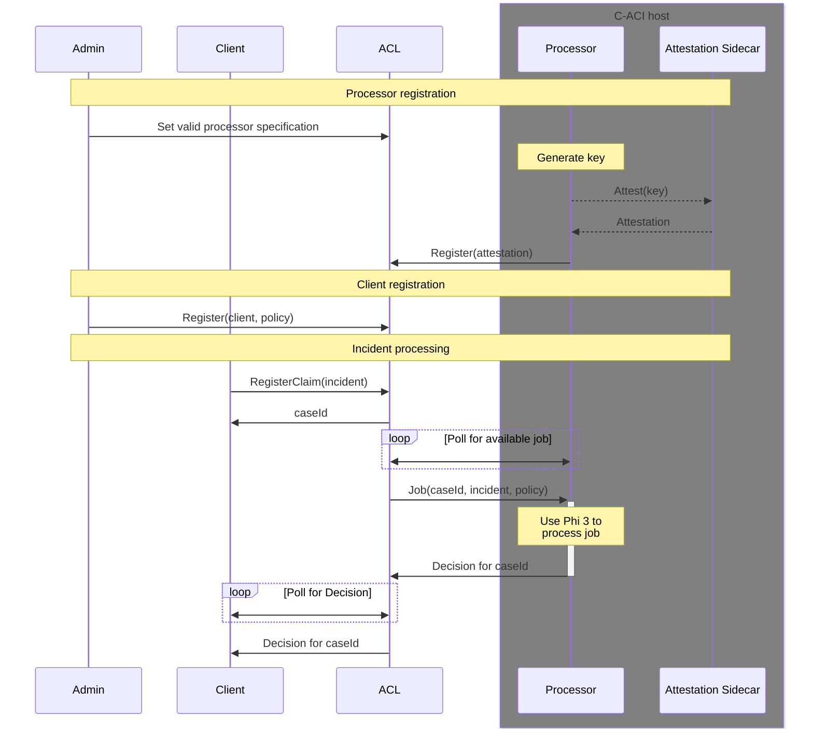

# Insurance sample for ACL

This sample demonstrates the capabilities of ACL to provide transparency and accountability for both the client and a insurance company

The aim is to offload heavy CPU processing tasks to attested containers.
Since these containers are attested, their processing of decisions can be trusted.

## Processes

## Build and run this sample

In `acl-app` execute `npm run build` then upload bundle to ACL via a http `PUT` request to `<acl-url>/app/userDefinedEndpoints?<api-version>`.

## GDPR considerations
If the incident description is considered PII, then it _cannot_ be stored in the ledger, as it cannot be removed at a later date.
Instead we suggest that users store a fingerprint (SHA-256 hash) of the incident description in the ledger and store the actual description of the incident in a separate database, that the processor then fetches the description from.
This should allow for compliance with the relevant regulations.