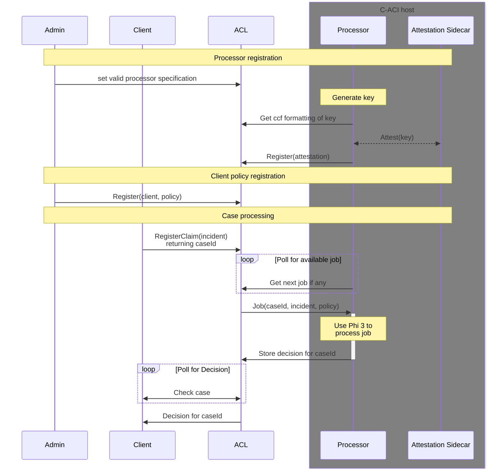

# Insurance sample for ACL

This sample demonstrates the capabilities of Programmable ACL to provide transparency and accountability for both the client and a insurance company.

The aim is to offload heavy CPU processing tasks to attested containers.
Since these containers are attested, their processing of decisions can be trusted, even though they are not executed via ACL.

## Prerequisites

Before running this sample, ensure you have the following tools installed:

### Required Software

1. **Node.js** (version 16 or higher)
   - Download from [nodejs.org](https://nodejs.org/)
   - Verify: `node --version`

2. **npm** (comes with Node.js)
   - Verify: `npm --version`

3. **Python 3**
   - Download from [python.org](https://python.org/)
   - Verify: `python --version` or `python3 --version`

4. **pip** (Python package manager)
   - Usually comes with Python
   - Verify: `pip --version` or `pip3 --version`

5. **Bash shell**
   - Linux/macOS: Available by default
   - Windows: Use Git Bash, WSL, or similar

6. **Azure CLI**
   - Install from [docs.microsoft.com/cli/azure/install-azure-cli](https://docs.microsoft.com/cli/azure/install-azure-cli)
   - Login: `az login`
   - Verify: `az --version`

7. **Docker** (for C-ACI container)
   - Download from [docker.com](https://docker.com/)
   - Verify: `docker --version`

8. **OpenSSL**
   - Required for certificate generation
   - Verify: `openssl version`

### Azure Requirements

- An active Azure subscription
- Permissions to create:
  - Azure Confidential Ledger instances
  - Azure Container Registry (ACR)
  - Azure Container Instances (ACI)
  - Resource groups
- Hugging Face token (for downloading the model)
  - Get one at [huggingface.co](https://huggingface.co)

## Processes

[Detailed diagram](./acl-app/README.md)

## GDPR considerations

If the incident description is considered PII, then it _must not_ be stored in the ledger, as it cannot be removed at a later date.
Instead we suggest that users store a digest (SHA-256 hash) of the incident description in the ledger and store the actual description of the incident in a separate database, that the processor then fetches the description from.
This should allow for compliance with the relevant regulations.

## Build and run this sample

### ACL app

- Ensure you have an instance of Programmable ACL
  - https://learn.microsoft.com/en-us/azure/confidential-ledger/programmability?tabs=CLI
  - Add a certificate based user with `administrator` access, hereafter admin certificate
    - Generate an ssl certificate and user
      - In `<repository-root>/insurance-app/acl-app/scripts`
      - `python -m 'import crypto; crypto.generate_or_read_cert("./admin")`
      - You may need to `pip install -r requirements.txt`
      - The resulting `admin.cert.pem` and `admin.privk.pem` are `<admin-cert>` and `<admin-key>` respectively
- Build the bundle
  - In `<repository-root>/insurance-app/acl-app`
  - Install dependencies: `npm install .`
  - Build the bundle: `npm run build`
- Test the app is working
  - `python scripts/unit-test.py --bundle dist/bundle.json --admin-cert <admin-cert> --admin-key <admin-key> --acl-url <acl-url>`
  - You may need to install the pip dependencies `pip install -r <repository-root>/insurance-app/acl-app/scripts/requirements.txt`
  - This test replays a previously captured uvm_endorsement and attestation for the processor

### C-ACI container

- In `<repository-root>/insurance-app/c-aci`
- Ensure that you have logged into the azure cli via `az login`
- Ensure you have an azure container repository set up
  - https://learn.microsoft.com/en-us/azure/container-registry/container-registry-get-started-azure-cli
- Ensure that you have a hugging face token to download the model
  - Get one at https://huggingface.com
- Build and push to the acr the attestation sidecar
  - `git clone https://github.com/microsoft/confidential-sidecar-containers.git`
  - `cd confidential-sidecar-containers`
  - `docker build -t <acr-name>.azurecr.io/attestation-sidecar -f docker/attestation-container/Dockerfile .`
  - `docker login -u 00000000-0000-0000-0000-000000000000 -p $(az acr login --name <acr-name> --expose-token --output tsv --query accessToken) <acr-name>.azurecr.io`
  - `docker push <acr-name>.azurecr.io/attestation-sidecar`
- Update `<repository-root>/insurance-app/c-aci/env.sh`
- Prepare image and arm-template
  - `HUGGINGFACE_TOKEN=<hugging_face_token> bash prepare-deploy-aci.sh`
  - Copy the hash in the final line of output for the policy
- Deploy to c-aci
  - `bash deploy-aci.sh`

Note: This sample provides ssh access to the container for debugging and exploration.
Production use should remove this and in the `arm-template.json` directly run the python processor.

### Testing the sample

- In two terminal sessions, start the client and the server
  - C-ACI start processor
    - `ssh -R 8000:localhost:8000 root@<container-ip> -- python3 /src/acl-processor.py --acl-url <acl-url> --uds-sock /mnt/uds/sock --prime-phi`
  - ACL-APP process claim
    - In `<repository-root>/insurance-app/acl-app`
    - Ensure the python dependencies are installed `pip install -r scripts/requirements.txt`
      - You may have to source or set up a python venv
    - `python scripts/c-aci-test.py --bundle dist/bundle.json --admin-cert <admin-cert> --admin-key <admin-key> --valid-processor-policy <policy> --valid-processor-measurement <measurement> --acl-url <acl-url>`
    - The policy is the last output line from the previous run of `az confcom acipolicygen` which should be in hex.
