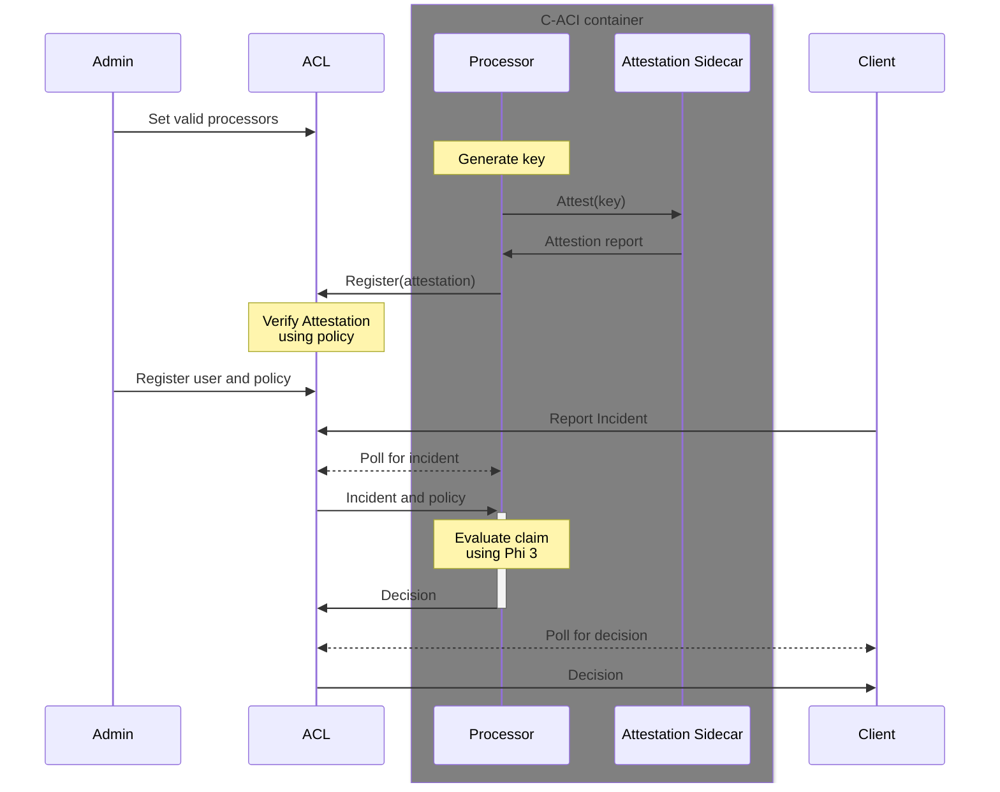

# Insurance sample for ACL

This sample demonstrates the capabilities of ACL to provide transparency and accountability for both the client and a insurance company

The aim is to offload heavy CPU processing tasks to attested containers.
Since these containers are attested, their processing of decisions can be trusted.

## Processes

### Processor registration
- Processor: Submits attestation for signing key
  - ACL: if valid processor attestation (valid measurement, uvm and policy) store signing key and attestation

### Incident claim

- Client: submits incident fingerprint to ACL, receives back case number, and current policy
  - ACL maps case number to metadata (policy and incident fingerprint)
- Client: submits incident, case number and policy to a processor container
- Processor: reaches decision, submits to ACL case number, incident fingerprint, policy and decision
  - ACL stores case decision if the processing service and policy is valid, and there has not been a previously submitted decision.
- Client polls for result of decision.

## Build and run this sample

In `acl-app` execute `npm run build` then upload bundle to ACL via a http `PUT` request to `<acl-url>/app/userDefinedEndpoints?<api-version>`.
