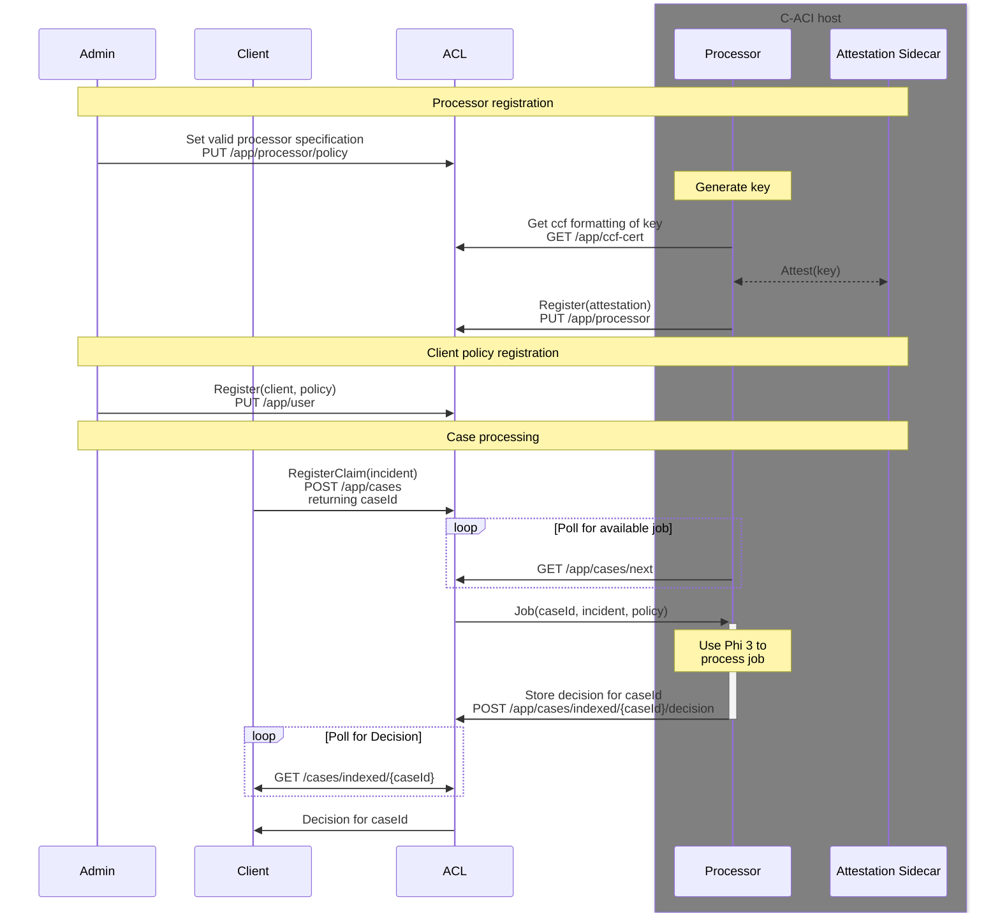

# ACL app

### Message flow with detailed endpoints

```mermaid
sequenceDiagram
  participant Admin
  participant C as Client
  participant A as ACL

  box Gray C-ACI host
    participant P as Processor
    participant S as Attestation Sidecar
  end

  note over Admin,S: Processor registration

  Admin ->> A: Set valid processor specification<br>PUT /app/processor/policy

  note over P: Generate key
  P ->> A: Get ccf formatting of key<br>GET /app/ccf-cert
  P <<-->> S: Attest(key)
  P ->> A: Register(attestation)<br>PUT /app/processor

  note over Admin, S: Client policy registration

  Admin ->> A: Register(client, policy)<br>PUT /app/user

  note over Admin, S: Case processing

  C ->> A: RegisterClaim(incident)<br>POST /app/cases<br>returning caseId

  loop Poll for available job
  P ->> A: GET /app/cases/next
  end
  A ->>+ P: Job(caseId, incident, policy)
  note over P: Use Phi 3 to<br>process job
  P ->>-A: Store decision for caseId<br>POST /app/cases/indexed/{caseId}/decision

  loop Poll for Decision
  C <<->> A: GET /cases/indexed/{caseId}
  end
  A ->> C: Decision for caseId
```
