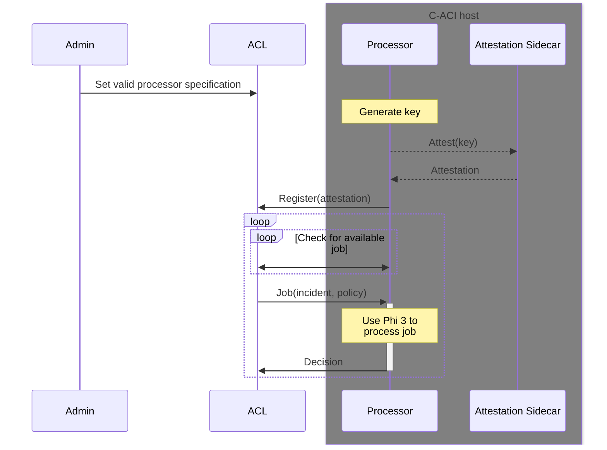

# C-ACI external attested processor for Insurance app

# Testing the processor locally

`src/test-server.py` runs a basic flask server which serves the endpoints of the ACL app for testing, without any logic behind it.
